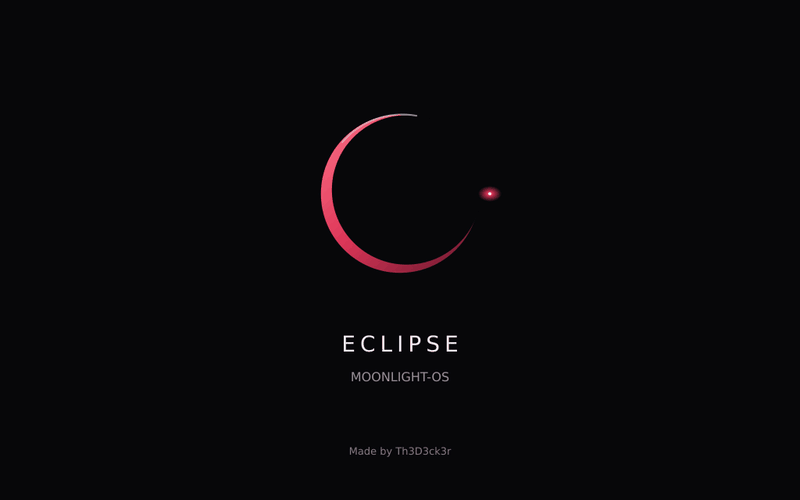

<div align="center">

# 🌙 Moonlight-OS
### Your MacBook. A dedicated streaming console. 🎮

**Fedora 44 · Five frontend choices · Intel x86_64 · Native UEFI**

A controller-friendly USB appliance for the **2017 13-inch non-Touch-Bar MacBook Pro — MacBookPro14,1**, connecting to **Vibepollo / Sunshine-compatible hosts**.

**[🌙 Current release](https://github.com/th3d3ck3r/Moonlight-OS/releases/tag/v0.1-experimental.20261002) · [🖤🔴 New experimental](https://github.com/th3d3ck3r/Moonlight-OS/releases/tag/v0.2-experimental.20261002) · [⬇️ Previous repair download](https://github.com/th3d3ck3r/Moonlight-OS/actions/runs/36972953272/artifacts/11213197745) · [🚀 Setup](#quick-start) · [✨ Features](#features) · [🩺 Troubleshooting](#troubleshooting) · [🌑 Animation](#crimson-apollo-animation-preview) · [🧭 Roadmap](#independent-feature-plans) · [🧪 Test plan](docs/TEST_PLAN.md)**

</div>

---

## 🌙 Current release — Apollo, Bluetooth & five frontends

**[⬇️ Current release](https://github.com/th3d3ck3r/Moonlight-OS/releases/tag/v0.1-experimental.20261002) · [📦 One-file Actions ZIP](https://github.com/th3d3ck3r/Moonlight-OS/actions/runs/36995905431/artifacts/11223945065) · [📖 Download / flashing guide](docs/releases/v0.1-experimental.20261002.md)**

Includes the **black/crimson animated Apollo moon boot screen**, a remembered selector for **Vibemis / Artemis / Pegasus / Moonlight / CocoOS**, and generic guided Bluetooth pairing with confirmation prompts and verified connection state. All Intel, English UI, Openbox/display, audio, Mac media-key and console repairs remain included.

**All six audits, installed-image inspection and strict OVMF boot passed** for image commit `32bc89855f8bac3caf90b9d5177ae583bc50313d`. The user confirmed boot, animation and Bluetooth pairing on the Mac and prefers Vibemis. Exact device-by-device AirPods/controller features, decoder telemetry and sustained streaming checks still need results. The previous repair download below stays available as a fallback; this image is now promoted to a regular release; the new theme/status image remains separately experimental.

**One complete download; no split files.** The current release links to the original Actions ZIP (about **3.62 GiB**), containing the compressed image and checksum. GitHub may require sign-in; the artifact expires October 16. No image is attached as a release asset because it exceeds GitHub's per-file limit. Do not flash GitHub's automatic source-code ZIP.

## 🛠️ Frontend source work — not a new download

Wi-Fi and Bluetooth selectors are implemented in source for the next image: scan, connect/pair, disconnect, and confirmed Bluetooth forget. All seven source audits passed, including the native frontend compile and selector tests. Customized Vibemis uses Moonlight-OS release guidance and disables upstream standalone replacement. [Feature brainstorm and control-center plan](docs/VIBEMIS_FEATURE_PLAN.md) includes lightweight audio, brightness, host, profile and recovery ideas; those ideas are not implemented by this change. No OS image build or download-link change has been started.

## 🖤🔴 New experimental — Vibemis Crimson

**[🧪 Experimental release](https://github.com/th3d3ck3r/Moonlight-OS/releases/tag/v0.2-experimental.20261002) · [📦 One-file image ZIP](https://github.com/th3d3ck3r/Moonlight-OS/actions/runs/37022392821/artifacts/11235677661) · [📖 Download / flashing guide](docs/releases/v0.2-experimental.20261002.md)**

Full-app black/crimson palette, sixteen accent colors and three matching top-bar buttons for **network**, **battery** and **Vibepollo host CPU/RAM/GPU hardware stats**. Generic Bluetooth starts with a shorter six-second scan. [Implementation and host-stats setup](docs/VIBEMIS_CRIMSON.md). **All seven source audits, installed-image inspection and strict OVMF boot passed** for source `ebce257c6429f5b363ba0ec6a17815e524d87f29`. The complete ZIP is about **3.86 GiB**, raw image **12.24 GiB**, with a 16 GB drive requirement; the artifact expires October 16. Physical testing of this new image remains pending. The regular release above stays available.

## ✅ Previous v0.1 repair — built, inspected, boot validated

**Validated on October 2, 2026.** [Repair image build](https://github.com/th3d3ck3r/Moonlight-OS/actions/runs/36972953272) installed Fedora, compiled both pinned clients and Cirrus audio, passed read-only image inspection, and booted through QEMU/OVMF with the required `MOONLIGHT_OS_BOOT_OK` gate. All five jobs in [audit #79](https://github.com/th3d3ck3r/Moonlight-OS/actions/runs/36972953285) passed on the exact build commit. This download includes the Intel, English UI, window-sizing, console, audio-helper and media-key repairs.

| 📦 Download details | Value |
| --- | --- |
| Artifact | [moonlight-os-mbp14-1](https://github.com/th3d3ck3r/Moonlight-OS/actions/runs/36972953272/artifacts/11213197745) |
| ZIP contents | `moonlight-os-mbp14-1.raw.xz` + `moonlight-os-mbp14-1.raw.xz.sha256` |
| Download size | About **3.23 GiB** |
| Uncompressed image | **12.24 GiB / 13,147,045,888 bytes** |
| USB requirement | **16 GB or larger** |
| Artifact expires | **October 16, 2026** — run the build workflow for a fresh artifact |

> 🛠️ **Physical Mac testing confirmed:** booting and desktop streaming, H.264/HEVC decode capability after the full Intel driver fix, native-resolution sizing with Openbox, direct desktop mouse mode, speaker mixer adjustment, and screen/keyboard brightness plus volume keys. The new image contains these repairs and English CocoOS labels. Actual decoder telemetry, reboot persistence, mute/keys during active streaming, AirPods and DualSense still need their physical checks. Hardware mixer levels may need a one-time adjustment/save on a newly flashed image because the exact working values were not supplied.

## 🔴 Confirmed on the Mac — October 2

| Area | Current evidence |
| --- | --- |
| 💾 USB boot + streaming | The user booted Moonlight-OS on MacBookPro14,1 and streamed the Windows host desktop |
| 🔆 Screen brightness | Physical shortcut keys confirmed working |
| ⌨️ Keyboard brightness | Physical shortcut keys confirmed working |
| 🔊 Volume | Physical shortcut keys confirmed working; hardware mixer adjustment fixed quiet speakers |
| 🖥️ Display / pointer | Openbox fixed native-resolution sizing; direct mouse mode fixed desktop-stream pointer speed |
| ⚡ Intel decoding | Full Intel driver exposes H.264/HEVC VLD profiles; actual video-engine use still needs telemetry confirmation |
| 🇬🇧 English UI | Checked English labels compiled into the repaired image; confirm the UI after flashing it |
| 🧪 Still to test | Mute, media keys during active streaming, reboot persistence, AirPods, DualSense and sustained performance |

The new download passed image inspection and OVMF. Your physical test results came from the existing USB with the applied fixes; they do not replace a boot test of the newly flashed download.

<a id="features"></a>

## ✨ What's inside

| Feature | Included configuration |
| --- | --- |
| 🖤🔴 Vibemis Crimson | New experimental: full-app dark palette, sixteen accents, network/battery/host hardware panels |
| 🎮 Frontend choices | Regular and experimental: **Vibemis, Artemis, Pegasus, Moonlight, CocoOS**; previous repair: CocoOS/Moonlight |
| 🌑 Boot animation | Regular and experimental: **Crimson Apollo**, black/red moon and orbiting spacecraft; Escape for details |
| 🛜 Bluetooth pairing | Regular and experimental: generic scan/pair/reconnect/disconnect/confirmed forget, with live confirmation agent |
| ⚡ Intel acceleration | Kernel `i915`, Intel VA-API H.264/HEVC decode stack, Mesa, and GPU diagnostics for Iris Plus 640 |
| 🖥️ Lean graphics session | Native **X11**, with no desktop environment or compositor |
| 📶 Wi-Fi setup | NetworkManager, guided first-boot connection, saved networks, and Wi-Fi power saving disabled |
| ⌨️ Input support | Apple SPI keyboard/trackpad modules, libinput, and USB/Bluetooth mouse and keyboard tooling |
| 🕹️ DualSense | USB/Bluetooth input via `hid-playstation`, pairing helper, joystick rules, and diagnostics |
| 🔇 Controller audio policy | DualSense USB speaker, microphone, and headset endpoints disabled while retaining input |
| 🎧 AirPods Pro 2 | Playback-only **A2DP**, SBC/SBC-XQ/AAC codec configuration, and **Low Latency / Quality** preference selection |
| 🔊 Internal audio | Pinned third-party Cirrus CS8409/CS42L83 driver built for the installed kernel |
| 🛠️ Guided settings | Wi-Fi, Bluetooth, AirPods, controllers, diagnostics, and client selection from tty2 |
| 💾 Persistent setup | Wi-Fi, Bluetooth, pairing, and client settings saved on the USB; first-boot XFS root growth |
| 🌡️ Diagnostics | Hardware verifier, VA-API checks, `intel_gpu_top`, input tools, and thermal management |
| 🔒 Reproducible builds | Pinned upstream commits and Fedora installer checksum in [SOURCES.lock](SOURCES.lock) |

**Boot flow:** Apple EFI → Fedora 44 / Crimson Apollo → Wi-Fi setup → remembered frontend chooser → X11/Openbox → selected client → streaming host. Initial default is Moonlight. The previous repair starts CocoOS.

CocoOS is a Moonlight-Qt fork whose interface is still evolving. After repeated client failures, the launcher falls back to upstream Moonlight. The selector remembers all five choices. Pegasus launches the four clients; it does not stream by itself. Vibemis and Artemis require their own host pairing.

**Performance targets:** idle memory below 2 GB and a low-latency streaming session. These are targets, not measured physical-hardware results. An 8 GB MacBook is the intended class of device.

<a id="quick-start"></a>

## 🚀 Quick start

### 1. Download and verify 🔍

[Download the current regular-release ZIP](https://github.com/th3d3ck3r/Moonlight-OS/actions/runs/36995905431/artifacts/11223945065), then unzip it. Choose the separate experimental download above to test the newer Vibemis theme and status panels. GitHub may require you to sign in.

Run the checksum command in the directory containing both downloaded files:

```bash
# Linux
sha256sum -c moonlight-os-mbp14-1.raw.xz.sha256

# macOS
shasum -a 256 -c moonlight-os-mbp14-1.raw.xz.sha256
```

**Continue only if verification reports OK.**

### 2. Flash the USB 💾

> ⚠️ **Flashing erases the entire destination drive.** Replace the example device with your USB's actual device name. Verify its identity and capacity first; do not select the internal SSD.

**Linux** — inspect disks with `lsblk`, unmount the USB's mounted partitions, then:

```bash
xzcat moonlight-os-mbp14-1.raw.xz | sudo dd of=/dev/sdX bs=16M status=progress conv=fsync
```

**macOS** — these commands require `xzcat` to be installed:

```bash
diskutil list
diskutil unmountDisk /dev/diskN
xzcat moonlight-os-mbp14-1.raw.xz | sudo dd of=/dev/rdiskN bs=16m
diskutil eject /dev/diskN
```

**Windows — your tested method:** extract the Actions ZIP with **WinRAR**, verify the included compressed-image checksum, then extract the `.raw.xz`. Rename the resulting `.raw` to `.img` and select it in **Rufus**; use raw/DD writing when offered. Choose the external drive carefully, wait for completion and safely eject.

**Future builds produce `.img.xz` directly:** WinRAR extraction yields an `.img` ready for Rufus, with no rename needed. The currently published downloads still contain `.raw.xz`; both names represent the same raw disk-image format.

### 3. Boot and connect 📶

1. Insert the USB into the target MacBook.
2. Hold **Option (⌥)** at power-on and select **EFI Boot**.
3. If no network is saved, use the Wi-Fi helper's **Connect** option, powered by `nmtui-connect`.
4. Choose a frontend (Enter/eight-second timeout keeps the saved choice; first boot defaults to Moonlight). Previous repair starts CocoOS. Add/discover your host and complete pairing in the chosen client.
5. Start with **1080p60, H.264, hardware decoding, V-Sync, and frame pacing enabled**. Compare HEVC and network options after confirming a stable stream.

The appliance is designed to run from USB without installing to the internal SSD. Saved settings survive reboots.

## 🎛️ Everyday controls

| Shortcut / command | Purpose |
| --- | --- |
| **Ctrl+Alt+F1** | Return to the appliance session |
| **Ctrl+Alt+F2** | Open the black-and-red settings/recovery console |
| `moonlight-settings` | Launch the guided settings menu manually |
| `sudo moonlight-os-client cocoos` | Select CocoOS |
| `sudo moonlight-os-client moonlight` | Select upstream Moonlight |
| `moonlight-audio` | Open the hardware mixer and save adjustments on exit |
| `moonlight-audio save` | Save the current hardware mixer levels |
| `sudo moonlight-os-verify` | Inspect hardware, graphics, networking, audio, input, clients, and memory |
| `dualsense-check` | Inspect controller support |
| `moonlight-bluetooth` | Generic guided Bluetooth pairing and connection management |
| `dualsense-pair` / `airpods-pair` | Compatibility entry points for the same guided pairing flow |

### 🎮 Start any frontend

The boot chooser offers **1 Vibemis · 2 Artemis · 3 Pegasus · 4 Moonlight · 5 CocoOS**. Enter or the eight-second timeout keeps the remembered choice. Initial default and launch-failure fallback are vanilla Moonlight.

From tty2, settings option **9** opens selection; options **7/8** still select CocoOS/Moonlight. Save a choice with one of:

```bash
sudo moonlight-os-client vibemis
sudo moonlight-os-client artemis
sudo moonlight-os-client pegasus
sudo moonlight-os-client moonlight
sudo moonlight-os-client cocoos
```

Run only the command for the frontend you want. End the stream, then `sudo reboot` to apply it. On the Mac, **Control + Option + F1** returns to the graphical session (add Fn if needed). Pegasus offers launch entries for the four clients. Pair your host separately in each streaming client; their settings and credentials are independent. The previous repair supports only CocoOS/Moonlight and starts CocoOS by default.

**Generic Bluetooth pairing:** run `moonlight-bluetooth`, put the device in pairing mode, choose it and respond to confirmation/PIN prompts. Reconnect/disconnect and explicitly confirmed forget are available. DualShock 4: **SHARE + PS**. DualSense: **CREATE + PS**. AirPods Pro 2: hold the case pairing button. This flow checks paired/trusted/connected state and is not restricted to a controller brand; wireless support still requires Linux-compatible Bluetooth protocols. Proprietary radio devices require their dongle.

**DualSense pairing:** hold **CREATE + PS** until the light bar flashes rapidly, then use the pairing helper. The USB audio endpoints are suppressed; actual haptics and other controller features depend on the client and host.

**AirPods Pro 2:** pair through the settings menu and choose **Low Latency** or **Quality** preference. HSP/HFP microphone/headset roles are disabled. This preference does **not** guarantee a particular codec or latency; confirm negotiation and playback on your hardware.

**Local diagnostic user:** `moonlight`, with passwordless sudo in this development image. SSH is disabled by default. Normal boot and streaming should not require shell commands.

<a id="troubleshooting"></a>

## 🩺 Known limitations & troubleshooting

| Symptom / limitation | What to check or do |
| --- | --- |
| Vibemis host stats unavailable | Configure a read-only Vibepollo stats token and verify the HTTPS certificate; GameStream pairing alone is insufficient. Unsupported sensors show N/A. |
| Bluetooth missing after switching from macOS | BCM4350C0 may retain macOS' UART baud rate. Shut down, perform the standard SMC reset for this MacBook once, and retry. |
| Wi-Fi missing or unstable | Open tty2 settings and run `sudo moonlight-os-verify`. BCM4350 firmware/driver behavior still needs physical validation; compare a supported Ethernet adapter if available. |
| Black screen, slow decode, or stutter | Compare upstream Moonlight with CocoOS. Start at 1080p60/H.264; inspect VA-API and the performance overlay. Run the verifier and observe video-engine activity with `intel_gpu_top`. |
| CocoOS exits repeatedly | The launcher provides upstream Moonlight fallback. Select it explicitly from settings if needed. |
| Internal speakers unavailable | Check the Cirrus module and PipeWire sink with the verifier. The driver is third-party and tied to the pinned kernel. |
| AirPods delay or unexpected codec | Check the active A2DP configuration and compare the two preferences. Actual latency depends on Bluetooth conditions and negotiated codec. Microphone mode is intentionally unavailable. |
| DualSense speaker/mic absent | Expected policy on USB. Controller audio is disabled; verify controller input separately. |
| Keyboard, trackpad, or controller misbehaves | Use the verifier and [input test checklist](docs/TEST_PLAN.md). Installed modules alone do not prove real-device operation. |
| Root expansion fails | First-boot growth must succeed or explicitly report NOCHANGE; other failures remain retryable. Inspect `journalctl -u moonlight-os-grow-root.service` from tty2. |
| Image download expired | Run **Build Moonlight-OS image → Run workflow → main** to produce a fresh validated artifact. |
| FaceTime camera unavailable | Intentionally omitted; its separate driver/firmware path is outside this streaming appliance. |
| Optional CocoOS Companion features | Not required or claimed. Standard Sunshine/GameStream-compatible discovery, pairing, app listing, streaming, and input are the baseline. |

**Fixed during this build:** container partition probing, read-only inspection mount order, Fedora OVMF firmware discovery, and first-boot root partition-number detection. Root growth now has real GPT/XFS expansion, NOCHANGE, and failure/retry audit coverage.

**Kernel updates:** this image does not auto-update the kernel. Build a new image when changing kernels so the MacBook audio module stays aligned.

## 🧪 Automated UEFI preflight — four validation passes

1. **Repository checks:** shell/Kickstart validation, embedded helpers, source pins, and configuration checks.
2. **Fedora checks:** package dependencies, accelerated client configuration, exact-kernel Cirrus compilation, and SBC/AAC plugins.
3. **Installed-image inspection:** GPT/EFI/boot/XFS layout, removable-media bootloader, all selected-release client binaries, settings helpers, policies, and hardware modules.
4. **Boot check:** QEMU/OVMF boots a copy-on-write overlay and requires `MOONLIGHT_OS_BOOT_OK` before compression and upload.

The overlay preserves the release raw image. The root-growth audit also checks actual partition/filesystem expansion, unchanged EFI/boot partitions, NOCHANGE handling, and retry after failure.

**Continue physical validation.** Booting, desktop streaming and the reported controls already work on the Mac. Follow [docs/TEST_PLAN.md](docs/TEST_PLAN.md) for GPU decode, Apple input, networking, audio, AirPods, controller behavior, and sustained streams. Compare CocoOS/upstream Moonlight and Wi-Fi/Ethernet using the performance overlay.

## 🌿 Separate development tracks

| Branch | Purpose |
| --- | --- |
| [`main`](https://github.com/th3d3ck3r/Moonlight-OS/tree/main) | Current release baseline and shared fixes |
| [`mac-minimal`](https://github.com/th3d3ck3r/Moonlight-OS/tree/mac-minimal) | Future Vibemis-focused MacBookPro14,1 minimization after physical validation |
| [`generic-hardware`](https://github.com/th3d3ck3r/Moonlight-OS/tree/generic-hardware) | Preserve the current broader package/driver baseline for future generic x86-64 work |

Both development branches start with the same current source. **The generic branch is a baseline, not a hardware-compatible release yet:** Mac-specific boot options, audio/input policies and validation must be generalized separately. No drivers/packages were removed during this split. [Branch workflow and validation](docs/DEVELOPMENT_BRANCHES.md).

## 🏗️ Build your own image

### GitHub Actions

Open **Actions → Build Moonlight-OS image → Run workflow**, select `main`, and run it. Manual builds install from scratch and do not depend on temporary recovery artifacts. A successful run uploads the compressed image and checksum.

### Fedora 44 x86_64 host

Use a Fedora 44 host with virtualization available:

```bash
sudo dnf install -y lorax-lmc-virt qemu-kvm qemu-img edk2-ovmf curl xz util-linux xfsprogs e2fsprogs dosfstools pykickstart
sudo ./scripts/build-image.sh
```

Outputs:

```text
out/moonlight-os-mbp14-1.img.xz
out/moonlight-os-mbp14-1.img.xz.sha256
```

The `.img.xz` archive extracts to `moonlight-os-mbp14-1.img`; it uses the same raw disk format and the same image-inspection/OVMF gates. Existing `.raw` recovery artifacts remain supported.

The development image stays **under 14,000 MiB raw** while retaining Git, GCC, DKMS, kernel headers, source trees, and diagnostic tools. A smaller appliance image is a future goal.

**Fedora installer workaround:** Fedora 44 base media includes an older `igt-gpu-tools 2.2` build with a stale libproc2 dependency. Moonlight-OS installs current IGT from Fedora updates during post-install, preserving GPU telemetry without blocking Anaconda.

## 📚 Project notes

- [Build status](BUILD_STATUS.md)
- [Hardware and streaming test plan](docs/TEST_PLAN.md)
- [Planned host stats overlay and dashboard button](docs/HOST_OVERLAY_PLAN.md) — follow-up after physical boot validation
- [Liquid Glass–inspired GUI plan](docs/LIQUID_GLASS_GUI_PLAN.md) — cohesive client and appliance settings redesign
- [Black-and-red terminal settings plan](CODEX_CLI_INTERFACE_PROMPT.md) — independent, self-contained execution prompt; no new image build
- [Crimson Apollo boot animation](CODEX_BOOT_ANIMATION_PROMPT.md) — included in the regular release; user confirmed the animation
- [Pinned sources](SOURCES.lock)
- [Third-party software](docs/THIRD_PARTY.md)

## ⚖️ License

Moonlight-OS build scripts are **GPL-3.0**. Included third-party software retains its upstream license, including Moonlight-Qt/CocoOS (GPL-3.0). See [docs/THIRD_PARTY.md](docs/THIRD_PARTY.md).

## ⌨️ Mac keyboard shortcuts and confirmed repairs

**Option = Alt; Control = Ctrl.** Use Fn for F-keys when your keyboard sends media keys instead. Command is not a substitute for Control. These shortcuts apply to the Linux USB appliance.

| Action | Mac keyboard |
| --- | --- |
| Return to CocoOS/Moonlight | Control + Option + F1 (add Fn if needed) |
| Open settings/diagnostic console | Control + Option + F2 (add Fn if needed) |
| Toggle direct desktop pointer / captured game mouse during a stream | **Control + Option + Shift + M** |
| Stop a console command | Control + C |
| Finish saving text entered with `tee` | Enter, then Control + D |
| Choose the internal sound card in `alsamixer` | F6 (add Fn if needed) |
| Mixer level / mute / exit | Arrow keys / M / Esc |
| Screen brightness | Brightness keys (F1/F2 media functions) |
| Keyboard lighting | Keyboard-light keys (F5/F6 media functions) |
| Mute / quieter / louder | Audio keys (F10/F11/F12 media functions) |

A local media-key service reads brightness, keyboard-light and volume events independently of X11, so streaming keyboard grabs do not bypass it. It does not grab input or change ordinary/game keys. The user confirmed screen brightness, keyboard brightness and volume keys work on the Mac. Mute and behavior during streaming still need confirmation. Console switching and the stream mouse toggle were tested. Brightness and volume commands remain available from tty2.

### 🛠️ Repairs for the original downloadable image

- **Codecs:** `sudo dnf install intel-media-driver`, then `sudo vainfo --display drm --device /dev/dri/renderD128`. Require H.264 and HEVC **VLD** entries; installing a module alone is insufficient.
- **Sizing:** install Openbox with `sudo dnf install openbox`; start it with `DISPLAY=:0 openbox &`. Keep native **2560×1600**. A mode change from tty2 may fail while X11 is inactive; schedule it with `sleep 10; DISPLAY=:0 xrandr --output eDP-1 --mode 2560x1600`, then return to tty1 during the delay. New images start Openbox before either client and do not force a reduced display resolution.
- **Desktop pointer:** use the mouse-mode shortcut above. Keep captured mode available for games; local UI pointer speed needs no change.
- **Quiet speakers:** select the internal sound card in `alsamixer`, adjust available Master/Speaker/PCM controls, then run `sudo alsactl store`. New images offer `moonlight-audio` and settings option 9 to open the mixer and save on exit, and restore existing saved mixer state at boot. No untested maximum mixer level is forced.
- **Keyboard lighting:** `sudo brightnessctl -d spi::kbd_backlight set 50%`. New images initialize this LED at 50%; systemd can subsequently restore saved brightness.
- **Console:** `stty rows 100` was confirmed at native panel resolution. New images apply it on tty1/tty2 login for this target. It is a console geometry setting, not a graphical scale setting.
- **English:** the pinned CocoOS console has French source labels. The build applies a checked English source translation before compilation. OS locale changes alone do not translate the original binary. Host-provided app names and artwork remain host data.

The full Intel driver replaces Fedora's codec-restricted driver in the package manifest and read-only image check. GPU diagnostics now locate i915 and its corresponding render node dynamically rather than assuming `card0`, and require successful VA-API initialization plus decode entrypoints. AirPods testing is still pending.

### 🔆 Test brightness and volume keys on the existing USB

Run these from the diagnostic shell (a new repository folder is required only once):

```bash
git clone https://github.com/th3d3ck3r/Moonlight-OS
bash Moonlight-OS/scripts/install-media-keys.sh
```

The helper installs the same media-key service as new images, clears the older Openbox bindings to avoid applying each key twice, backs up the Openbox configuration, and reloads the running WM. It does not rebuild or reflash the USB. Test screen brightness, keyboard lighting, mute and volume in CocoOS first, then while streaming. If a key sends a function key rather than a media symbol, hold Fn. Volume increase is capped at 100%; use the saved hardware mixer adjustment if speakers remain quiet. Screen brightness, keyboard brightness and volume keys are confirmed on the Mac; mute and behavior during a stream still need confirmation.

<a id="crimson-apollo-animation-preview"></a>

## 🌑🚀 Crimson Apollo animation preview



[▶️ Open / save the animated GIF](https://raw.githubusercontent.com/th3d3ck3r/Moonlight-OS/main/assets/boot/crimson-apollo/preview.gif) · [🖼️ Still preview](assets/boot/crimson-apollo/poster.png)

Original artwork and a native Plymouth script theme are integrated into the image recipe: a crimson moon, orbiting Apollo-inspired spacecraft and subtle loading lights. The script caches rotations, handles masked prompts and messages, and fits the display without changing its mode. **Both release channels include this animation; the user confirmed it working in the regular image.** The previous repair download predates it. The GIF is an artwork preview, not a recording of the Mac boot; the new experimental image still needs its own physical splash/handoff test. See [activation, recovery and validation](docs/BOOT_ANIMATION.md) and the [separate integration prompt](CODEX_BOOT_ANIMATION_PROMPT.md).

<a id="independent-feature-plans"></a>

## 🧭 Independent feature plans

| Project | Status | Self-contained plan |
| --- | --- | --- |
| 🖤🔴 Crimson Console | Planned terminal settings interface; not implemented | [CODEX_CLI_INTERFACE_PROMPT.md](CODEX_CLI_INTERFACE_PROMPT.md) |
| 🌑🚀 Crimson Apollo | Included in both release channels; native script/image/OVMF checks pass; user confirmed the regular image animation | [CODEX_BOOT_ANIMATION_PROMPT.md](CODEX_BOOT_ANIMATION_PROMPT.md) |
| 💎 Crimson Glass | Planned black/crimson graphical redesign; not implemented | [GUI plan](docs/LIQUID_GLASS_GUI_PLAN.md) |
| 📊 Host overlay / dashboard | Planned remote stats and host dashboard feature; not implemented | [Host plan](docs/HOST_OVERLAY_PLAN.md) |

Each project stays separate. The terminal and animation prompts explicitly prohibit starting an image build without a later build request. The previous repair activates neither feature. Both release channels include Crimson Apollo; Crimson Console remains planning only.

---

<div align="center">

**🌙 Boot. Pair. Play.**
Built for a dedicated streaming setup — with the diagnostics to keep improving it.

</div>
