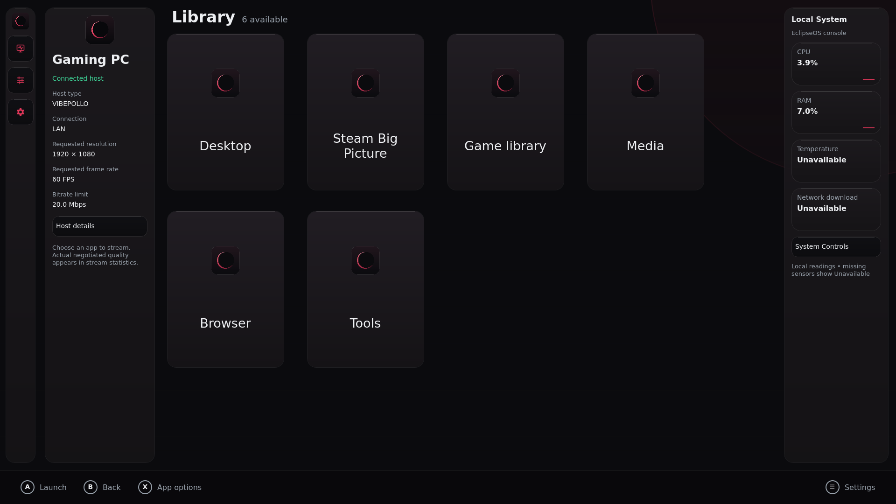
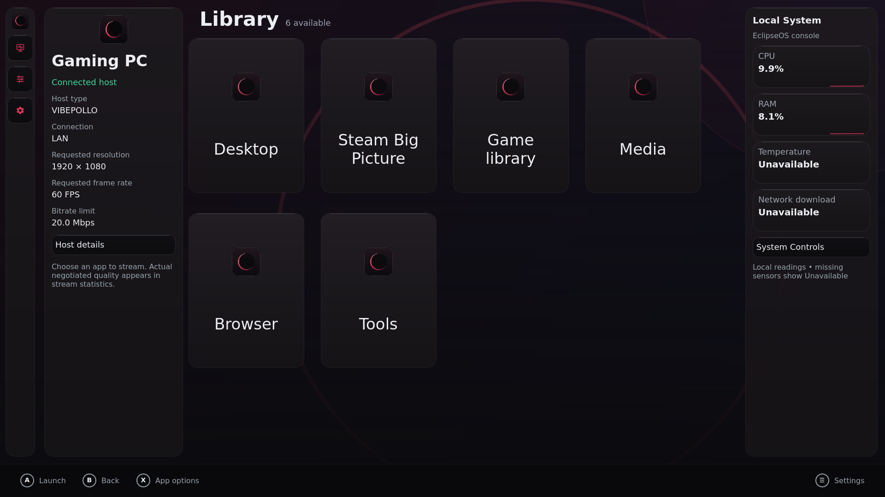
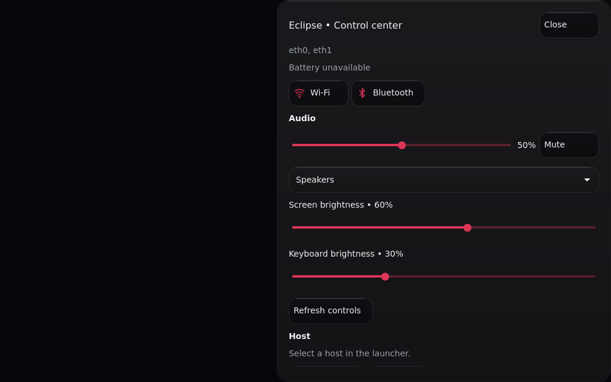
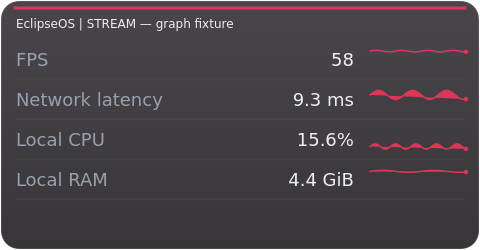
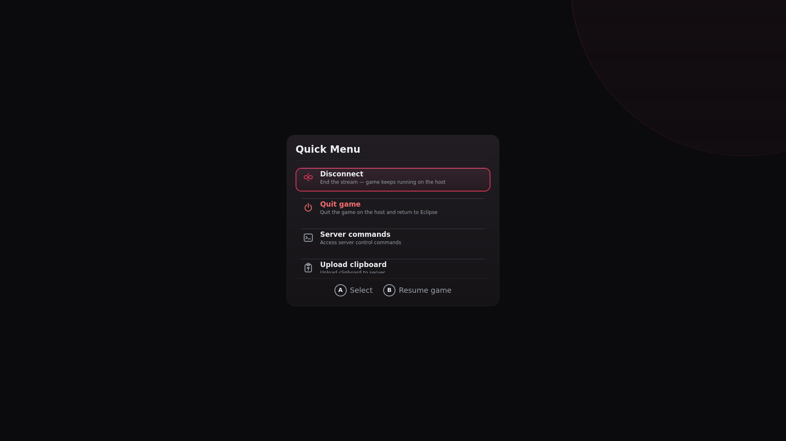

# 💎 Crimson Glass

Crimson Glass is the Eclipse frontend's black/crimson, Liquid Glass-inspired interface. It continues checkpoint `56dac41`; it preserves the existing discovery, pairing, library, launch, controller, System Controls, managed updates and recovery paths. The repository remains Moonlight-OS; the OS is EclipseOS and the frontend is Eclipse.

## Interface

- Host cards and app library use shared smoky panels, rounded controls and accent focus rings. Missing artwork now uses a themed Eclipse tile rather than a bright gray placeholder.
- A navigation rail and local-monitor sidebar appear when space permits. The wide library adds a host-information panel. Narrow grids remain scrollable and keep Add Computer reachable.
- Settings, Control Center, Wi-Fi/Bluetooth pickers, confirmations, context menus and Quick Menu share the palette. Dark scrims avoid the former gray modal backdrop. All sixteen accents and three text scales remain supported.
- Reduced motion suppresses status pulses and navigation/hover transitions; high contrast makes panels opaque and strengthens borders/background dimming.

## Select a background

Open **Settings → App & UI → Choose background**. Enter a local folder path (or `file:///` URL), open the folder and select an image. For USB/media files, browse its mounted folder, typically under `/run/media/moonlight`. PNG, JPEG, WebP and BMP are accepted up to 32 MiB with bounded image dimensions. The frontend stores a resized copy up to 2560 pixels in app data, so unplugging the source drive does not remove it. Adjust dimming from 30–90%, or reset to the default black canvas. High contrast applies at least 80% dimming.

## Overlay graphs

Stream cards show **measured rendering FPS, network RTT, local CPU and local RAM**. Local cards show **CPU, RAM, temperature and network download**. Each series retains 60 samples. Invalid or unavailable readings create gaps, never fabricated zeroes. Disabling an overlay clears its history. Detailed text statistics are still selectable; normal renderer/font/allocation fallbacks remain in place. Sampling leases keep a visible monitor active when another monitor closes.

## Actual UI previews

These images render production QML views in the Qt fixture, not generated concepts. Hosts/apps are illustrative fixture data; local readings come from the test environment and do not describe a physical Mac. The stream-graph image uses deterministic synthetic samples and is labelled as a fixture.

[Verification record](CRIMSON_GLASS_VERIFICATION.md) · [Known issues and physical acceptance](KNOWN_ISSUES.md). Other frontend choices remain available as preserved fallbacks; Crimson Glass styles Eclipse, not third-party host web pages or other frontend applications.
